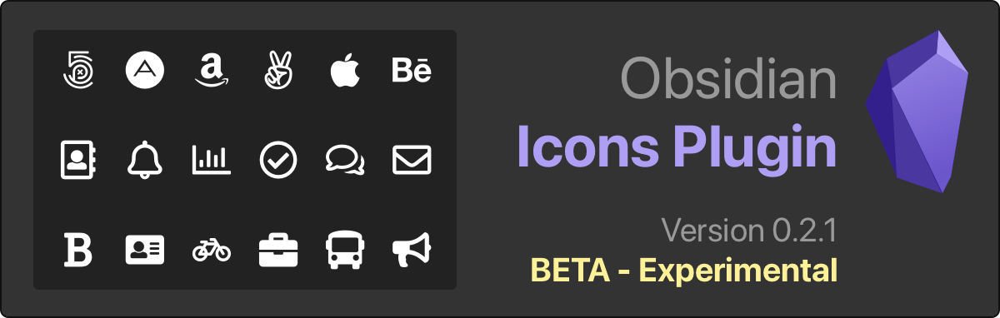
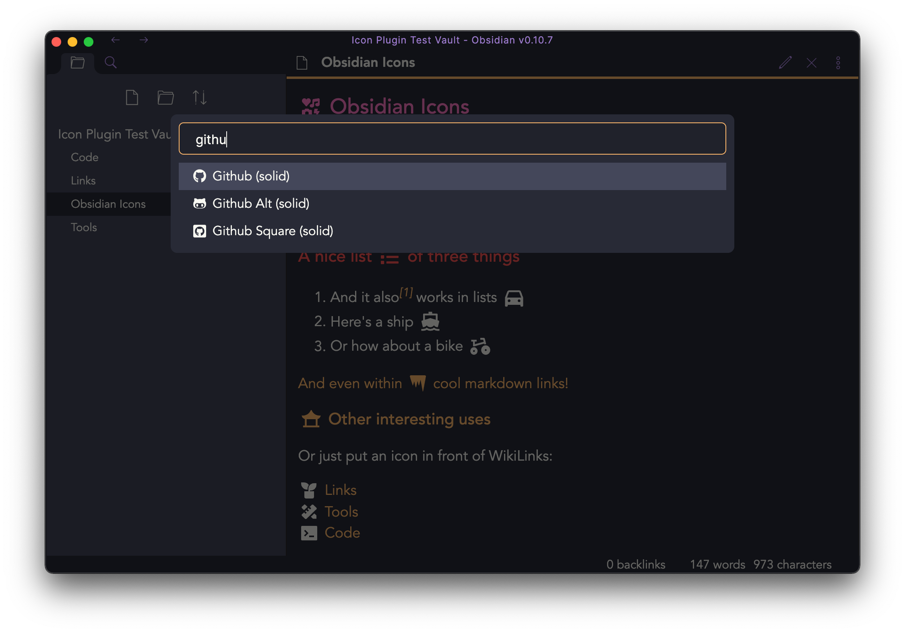

# Obsidian Icons Plugin – BETA ⚠️

Add icons to your Obsidian notes. Supported icon sets:

- [Remix Icon](https://remixicon.com/) - 2271 icons
- [FontAwesome (Free)](https://fontawesome.com/) - 1,609 icons
- _Roadmap includes more icon sets_

This plugin uses [react-icons](https://github.com/react-icons/react-icons) to render icons via a Markdown postprocessor. Inspired by [obsidian-citation-plugin](https://github.com/hans/obsidian-citation-plugin) and based on [obsidian-sample-plugin](https://github.com/obsidianmd/obsidian-sample-plugin).
## Demo and Screenshots

A demonstration video showing the icon picker and the rendered markdown.

Select any icon from the icon picker (selectively activate icon packs in the settings).

The rendered markdown will display the icons accordingly.

### How to use (BETA)

- Clone this repo to `./your-obsidian-vault/.obsidian/plugins/`
- `yarn` to install dependencies
- `npm run dev` to start compilation in watch mode.

### Releasing new releases

- Update your `manifest.json` with your new version number, such as `1.0.1`, and the minimum Obsidian version required for your latest release.
- Update your `versions.json` file with `"new-plugin-version": "minimum-obsidian-version"` so older versions of Obsidian can download an older version of your plugin that's compatible.
- Create new GitHub release using your new version number as the "Tag version". Use the exact version number, don't include a prefix `v`. See here for an example: https://github.com/obsidianmd/obsidian-sample-plugin/releases
- Upload the files `manifest.json`, `main.js`, `styles.css` as binary attachments.
- Publish the release.

### Adding your plugin to the community plugin list

- Publish an initial version.
- Make sure you have a `README.md` file in the root of your repo.
- Make a pull request at https://github.com/obsidianmd/obsidian-releases to add your plugin.

### Manually installing the plugin

- Copy over `main.js`, `styles.css`, `manifest.json` to your vault `VaultFolder/.obsidian/plugins/your-plugin-id/`.

### API Documentation

See https://github.com/obsidianmd/obsidian-api
