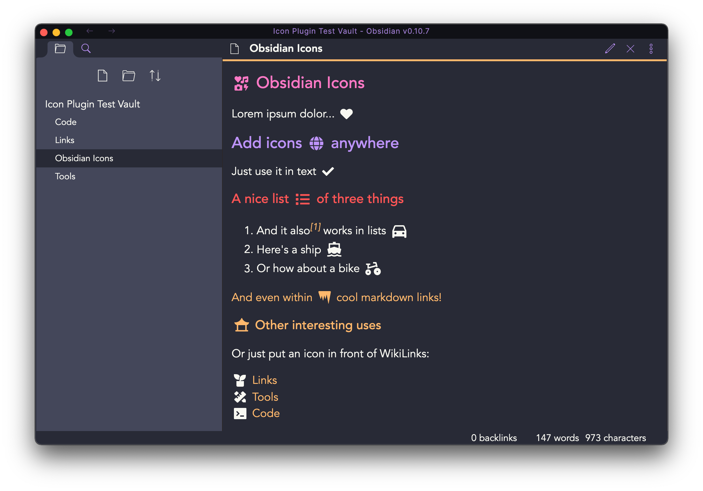

# Obsidian Icons Plugin

> **Note:**: This is an experimental plugin. Please report any bugs you encounter by opening a new issue on GitHub.

Add icons to your Obsidian notes. Supported icon sets:

- [Remix Icon](https://remixicon.com/) - 2172 icons
- [FontAwesome (Free)](https://fontawesome.com/) - 1560 icons
- _Roadmap includes more icon sets_

You can toggle which icon set(s) you want to display in the icon picker from within the _Icons Plugin_ settings.

This plugin uses [react-icons](https://github.com/react-icons/react-icons) to render icons via a Markdown postprocessor. Inspired by [obsidian-citation-plugin](https://github.com/hans/obsidian-citation-plugin) and based on [obsidian-sample-plugin](https://github.com/obsidianmd/obsidian-sample-plugin).
## Demo and Screenshots

> A demonstration video showing the icon picker and the rendered markdown.

> Select any icon from the icon picker (selectively activate icon packs in the settings).

> The rendered markdown will display the icons accordingly.

## How to report bugs

As this is an experimental plugin, bugs are expected to occur. Kindly open an issue in this repository and describe in detail what bug you encountered.

## Icon Sets and Licenses

Icon Set|License|Version|Count
---|---|---|---
[Font Awesome](https://fontawesome.com/)|[CC BY 4.0 License](https://creativecommons.org/licenses/by/4.0/)|5.12.1|1560
[Remix Icon](https://github.com/Remix-Design/RemixIcon)|[Apache License Version 2.0](http://www.apache.org/licenses/)|2.5.0|2172

## Development

## How to develop

- Clone this repo to `./your-obsidian-vault/.obsidian/plugins/`
- `yarn` to install dependencies
- `npm run dev` to start compilation in watch mode.

### Releasing new releases

- Update your `manifest.json` with your new version number, such as `1.0.1`, and the minimum Obsidian version required for your latest release.
- Update your `versions.json` file with `"new-plugin-version": "minimum-obsidian-version"` so older versions of Obsidian can download an older version of your plugin that's compatible.
- Create new GitHub release using your new version number as the "Tag version". Use the exact version number, don't include a prefix `v`. See here for an example: https://github.com/obsidianmd/obsidian-sample-plugin/releases
- Upload the files `manifest.json`, `main.js`, `styles.css` as binary attachments.
- Publish the release.
- Use `make release` for convenience

### Manually installing the plugin

- Copy over `main.js`, `styles.css`, `manifest.json` to your vault `VaultFolder/.obsidian/plugins/obsidian-icons-plugin/`.

### API Documentation

See https://github.com/obsidianmd/obsidian-api
